**##COIT20246 Cyber Security and Networking##**

**Project Specification 1**

Small Business Network Security, OpenWrt Firewall Configuration and
Cyber Security Risk Assessment

Student 1: Pavan Reddy Chinthalapally Student ID: 12327397

Student 2: Patel Ronak Ghanshyambhai Student ID: 12328755

Business Scenario: Small IT and Business Consultancy, Brisbane,
Queensland, Australia

**4.1 Network Setup**

**4.1.1 List the Assumptions**

Location: The business is assumed to operate in Brisbane, Queensland,
Australia.

Professional services: It provides IT support, cybersecurity consulting,
network configuration and business technology services.

Staff: 8 staff -- 1 Business Manager, 2 IT Support Specialists, 3
Business Consultants and 2 Administrative Staff.

Business/public information: The Website contains business and service
information, contact information, project information, and
Identification information of staff members/students needed for testing.

**4.1.2 Set Up the Network**

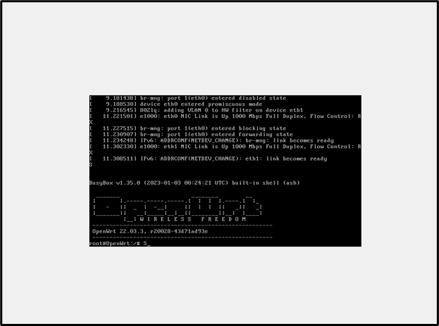

Figure 1: OpenWrt 22.03.3 Virtual Machine Boot and System Information
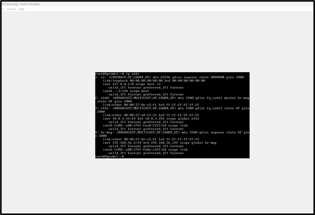

Figure 2: OpenWrt Network Interface Configuration and IP Address
Allocation
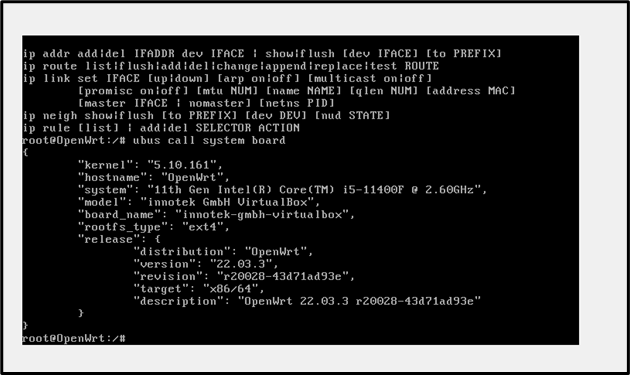

Figure 3: OpenWrt System and Virtual Machine Information

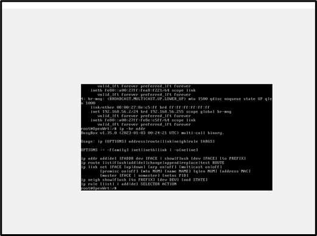

Figure 4: OpenWrt Network Configuration and Interface Mapping
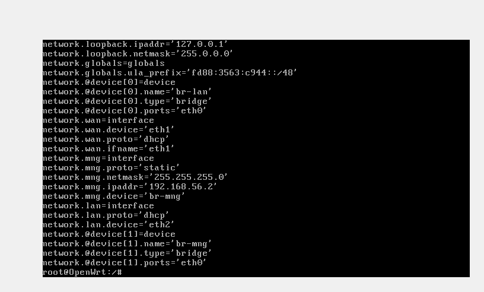

Figure 5: OpenWrt Network Interface and DHCP Configuration

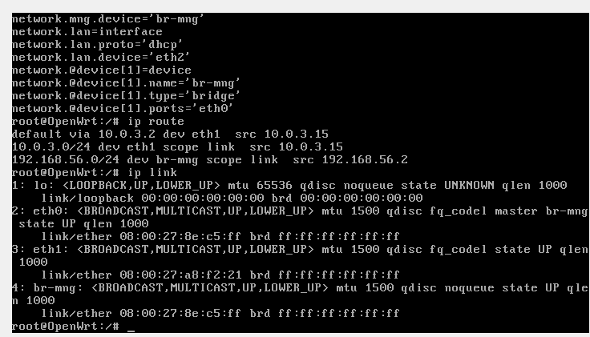

Figure 6: OpenWrt Routing Table and Network Interface Status

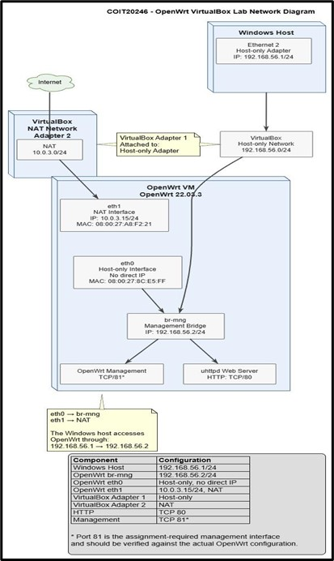

Figure 7: Proposed OpenWrt VirtualBox Laboratory Network Topology and IP
Address Allocation
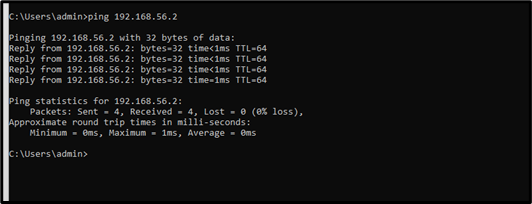

Figure 8: Successful ICMP Connectivity Test from Windows Host to OpenWrt

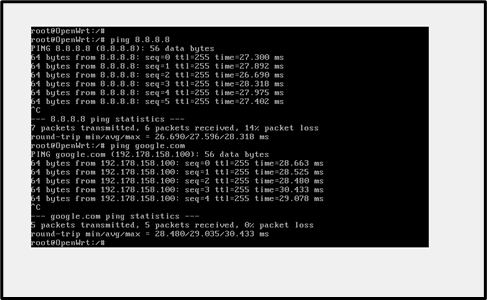

Figure 9: Successful Internet Connectivity Test from OpenWrt to External
Networks

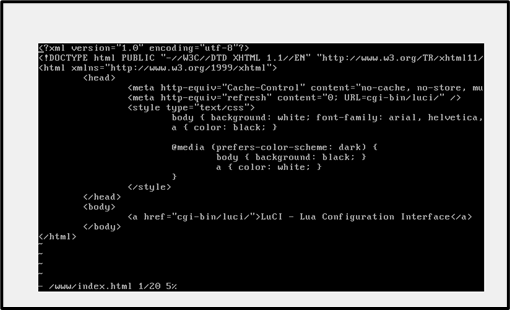

Figure 10: OpenWrt Web Interface HTML in /www/index.html

**4.1.3 Configure Firewall Rules**
 
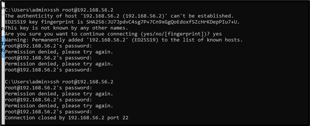

Figure 11: Failed SSH Authentication Attempt on OpenWrt Through TCP Port
22

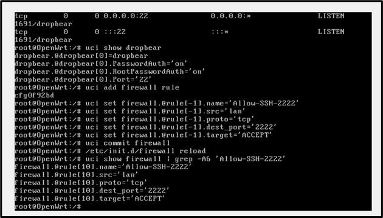

Figure 12: OpenWrt Firewall Configuration Allowing SSH Traffic on TCP
Port 2222
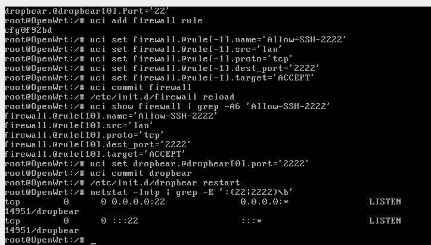

Figure 13: SSH Port Modification to TCP 2222 and Connection Refusal
During Port Verification

Figure 14: Successful Access to the OpenWrt Web Server Through HTTP

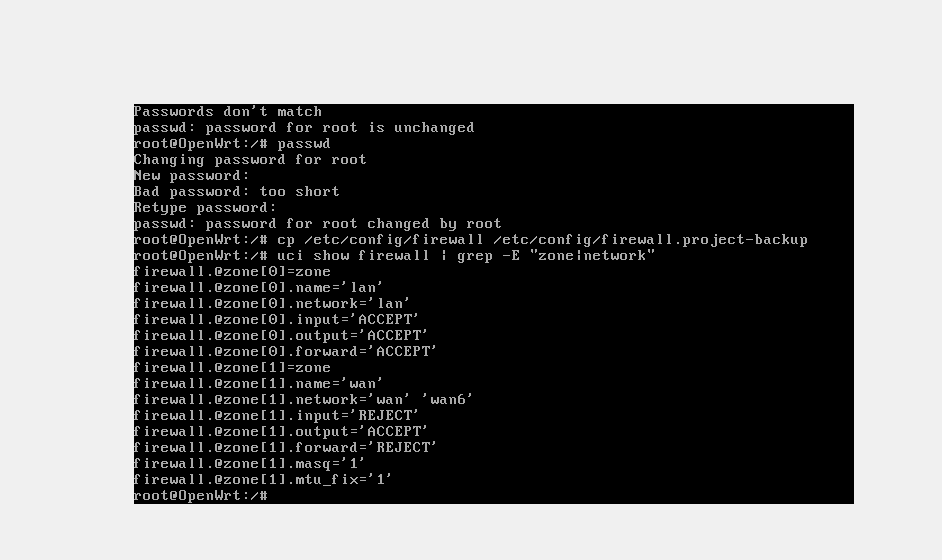

Figure 15: OpenWrt Root Password Hardening and Firewall Zone
Configuration

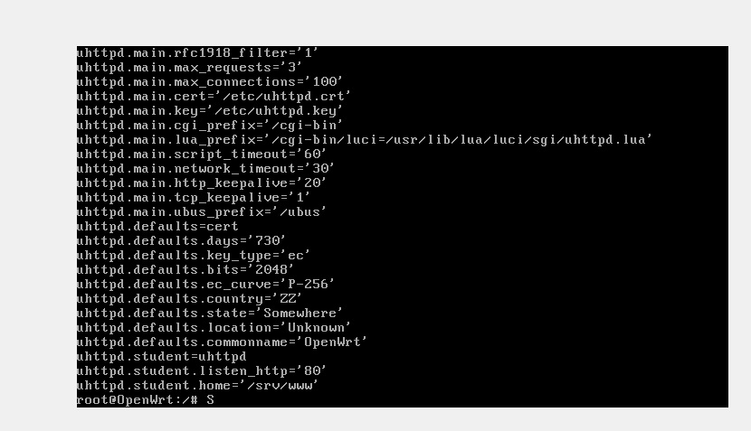

Figure 16: OpenWrt HTTP Service Configuration and TCP Port 80 Firewall
Rule

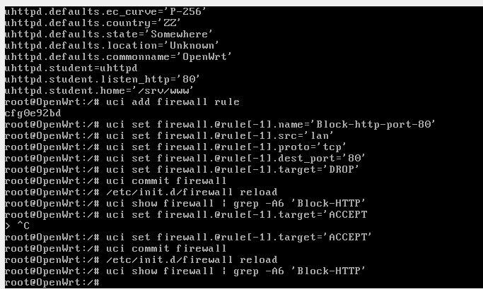

Figure 17: Successful ICMP Connectivity Test from Windows Host to
OpenWrt

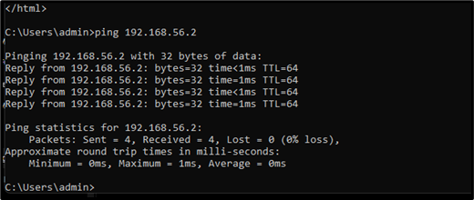

Figure 18: OpenWrt Firewall and Network Security Configuration Verification

Firewall Filtering provides some extra security on the network, as it
restricts access to key services. The block of port 80 prevents any
unauthorised access of web services and then it is opened back to test
the service availability in a controlled way. Administrative access
through SSH port 22 is initially allowed and it is later switched to
port 2222 thus lessening the chances of making SSH automatic attacks
(Kuruppathukattil, 2025). Blocking ICMP helps prevent network
reconnaissance, re-enabling it when it is needed for connectivity
testing. The management interface port 81 is limited and access to it
may not be provided to any unauthorised administrative access. Together,
these rules mandate controlled connectivity, eases the attack surface,
protects administrative services and enhances network security.

**4.1.4 Network Diagram and Address Allocation Production**

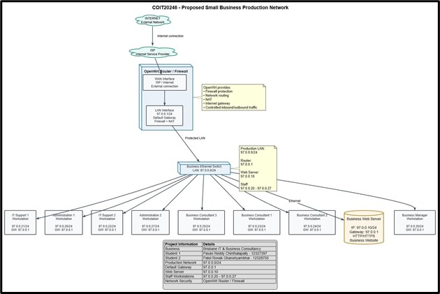

Figure 19: Proposed Small Business Production Network Topology and IP
Address Allocation

The suggested production network includes a OpenWrt router/firewall for
Internet connection and several routing and NAT services, thus offering
traffic protection and routing to the Internet. The protected
97.0.0.0/24 LAN is used to physically connect the business Ethernet
switch and the dedicated web server to 8 staff workstations. The web
server uses 97.0.0.10, while staff devices use 97.0.0.20--97.0.0.27
(Gentile et al. 2024). The default gateway for the router is 97.0.0.1.
The structured design facilitates safe connectivity, managed network
access, business website functionality and resource management.

**4.1.5 IP Addressing Requirements**

| **Device / Role** | **IP Address** | **Subnet Mask** | **Default Gateway** | **Purpose** |
|---|---|---|---|---|
| **OpenWrt Router/Firewall** | `97.0.0.1` | `255.255.255.0` (`/24`) | `---` | Network gateway, routing and firewall |
| **Business Web Server** | `97.0.0.10` | `255.255.255.0` (`/24`) | `97.0.0.1` | Business website |
| **Business Manager** | `97.0.0.20` | `255.255.255.0` (`/24`) | `97.0.0.1` | Staff workstation |
| **IT Support 1** | `97.0.0.21` | `255.255.255.0` (`/24`) | `97.0.0.1` | Staff workstation |
| **IT Support 2** | `97.0.0.22` | `255.255.255.0` (`/24`) | `97.0.0.1` | Staff workstation |
| **Business Consultant 1** | `97.0.0.23` | `255.255.255.0` (`/24`) | `97.0.0.1` | Staff workstation |
| **Business Consultant 2** | `97.0.0.24` | `255.255.255.0` (`/24`) | `97.0.0.1` | Staff workstation |
| **Business Consultant 3** | `97.0.0.25` | `255.255.255.0` (`/24`) | `97.0.0.1` | Staff workstation |
| **Administration 1** | `97.0.0.26` | `255.255.255.0` (`/24`) | `97.0.0.1` | Staff workstation |
| **Administration 2** | `97.0.0.27` | `255.255.255.0` (`/24`) | `97.0.0.1` | Staff workstation |

**4.2 Security Hardening and Traffic Analysis**

**4.2.1 Harden the OpenWRT System**

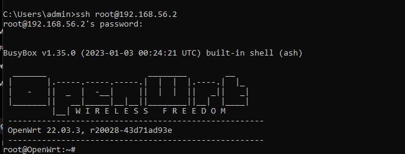

Figure 20: Successful SSH Login to the OpenWrt Virtual Machine

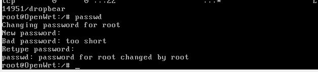

Figure 21: Successful Root Password Change on OpenWrt

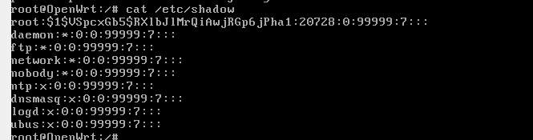

Figure 22: OpenWrt Password Hashes Stored in /etc/shadow

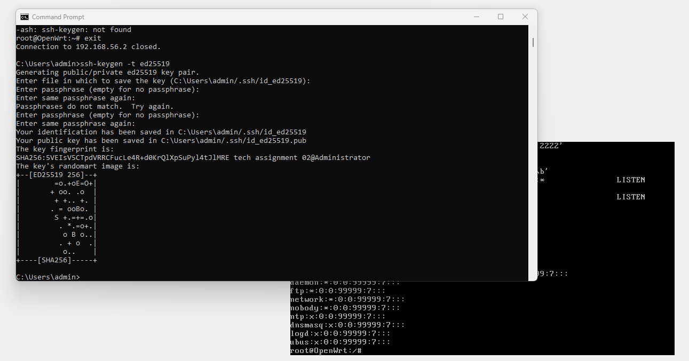

Figure 23: Ed25519 SSH Key Pair Generation on the Windows Host

Key-based authentication is more secure because it uses a cryptographic
key pair instead of relying solely on passwords. The private key remains
securely on the authorised device, while the public key is stored on
OpenWrt. This reduces exposure to password guessing, brute-force
attacks, credential theft, and password reuse.

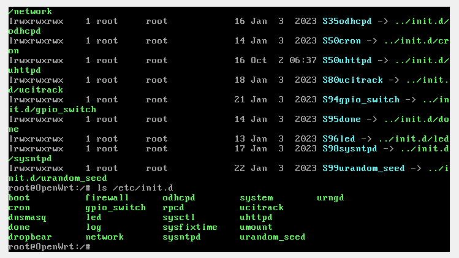

Figure 24: OpenWrt Enabled Services and Startup Configuration

Disabling unnecessary services reduces the system's attack surface by
removing functions that are not required. Fewer active services mean
fewer open ports, processes, and potential vulnerabilities for attackers
to exploit. This limits possible entry points, reduces security risks,
and makes the OpenWrt system easier to monitor and maintain securely.

**4.2.2 Capture and Analyse Network Traffic**

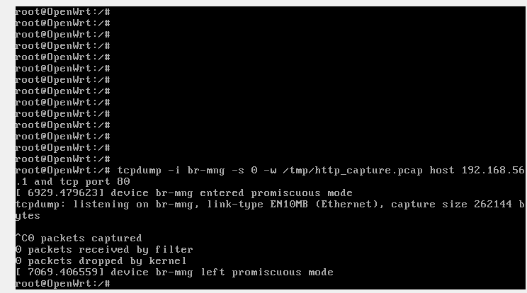

Figure 25: HTTP Traffic Capture Using tcpdump on the OpenWrt br-mng
Interface

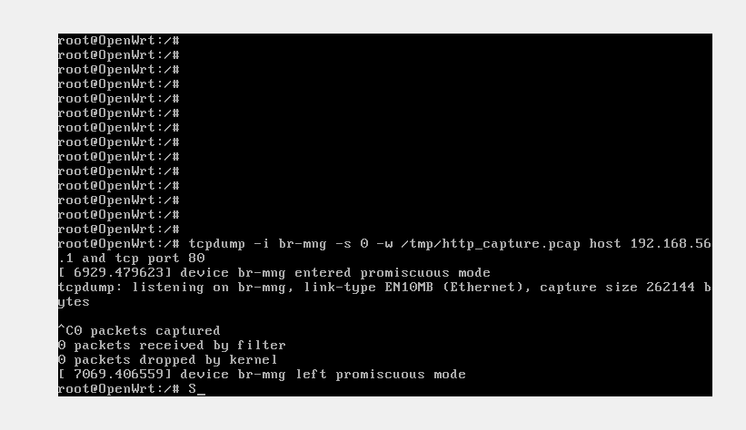

Figure 26: HTTP Traffic Capture Using tcpdump with Host and TCP Port
Filtering

Figure 27: Captured Network Traffic Displayed in Wireshark (HTTP)

The attacker who taps information from an HTTP stream is able to obtain
the server and client IP addresses, the request and response URL, HTTP
requests and responses, and the content of the target web pages.
Personal information, including names, student IDs or details that could
be seen from the webpage, might be given away due to lack of encryption
in the HTTP. Any traffic monitoring, and information disclosure, would
be possible.

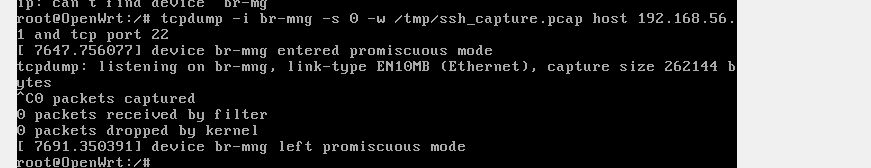

Figure 28: SSH Traffic Capture Attempt Using tcpdump on OpenWrt

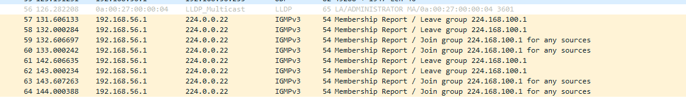

Figure 29: SSH Network Traffic Packets Displayed in Wireshark During
Traffic Analysis

In the HTTP capture it is possible to read webpage content and requests.
Encrypted protocols like SSH, on the other hand, keep contents of the
sessions secure from being viewed directly. Encryption ensures the
confidentiality of the data being sent, minimising the chances of
attackers being able to obtain commands, credentials or any other
sensitive information through network interception.

  ### Hardening Summary

| **Hardening Step** | **Security Risk Addressed** |
|---|---|
| **1. Change Default Root Password** | Reduces the risk of unauthorised administrative access through default or easily guessed credentials. A strong, unique password makes credential-based attacks more difficult. |
| **2. Examine Password Storage in `/etc/shadow`** | Addresses the risk of password disclosure. Storing passwords as hashes rather than plaintext prevents the original passwords from being directly exposed if the password database is accessed. |
| **3. Set Up SSH Key-Based Authentication** | Reduces the risk of password guessing and brute-force attacks. SSH keys provide stronger authentication than password-only access, particularly when a passphrase protects the private key. |
| **4. Disable Unnecessary Services** | Reduces the attack surface of OpenWrt. Unnecessary services can provide additional entry points that an attacker could exploit. |

**4.3 Risk Assessment and Security Controls**

**4.3.1 Conduct a Cyber Security Risk Assessment**

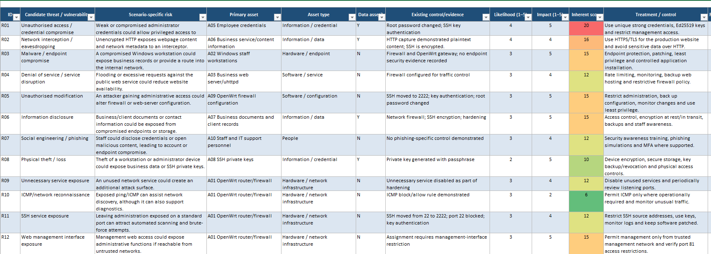

Figure 30: Cybersecurity Risk Assessment Matrix and Recommended Controls

A mini business network developed in Sections 4.1 and 4.2 is subject to
a mini cyber security risk assessment, carried out with the TVAMatrix
template. The assessment included 12 types of information security
threats such as: unauthorised access, network interception, malware,
denial of service, unauthorised modification, information disclosure,
phishing, physical theft, unnecessary service exposure, ICMP
reconnaissance, SSH exposure, management-interface exposure. The assets
covered hardware, software/services, information/data, credentials and
the people. These were business/client records, business/Service
information, employee credentials and SSH private keys. The controls
that already existed were firewall rules, SSH key authentication,
hardening of the root password, encryption and turning off unnecessary
services.

**4.3.2 Recommend Security Controls**

Employee credentials (A05) is the highest-risk data asset, with an
inherent risk score of 20. There are three suggested security controls:

1.  Multi-Factor Authentication (MFA): This decreases the likelihood of
    a credential being compromised. Must be activated for administrators
    and employees. This could result in longer logon, and use of an
    additional authentication mechanism will be necessary for users.

2.  Strong Authentication and SSH Key Management: Use of SSH Key
    Management is highly encouraged and SSH keys are going to replace
    password access, where the private key is protected with a
    passphrase (Makris, 2024). Moving SSH from its own port 22 and
    hardening its access with port 2222 means less exposure from a
    brute-force approach. The key management may cause recovery and
    admin overhead.

3.  Access Control/Firewall Restrictions: Administrative services should
    be networked within a management network and unneeded ports should
    be closed. A foundation of exit and entry firewall rules for SSH,
    HTTP and ICMP and management.

**4.4 Project Reflection**
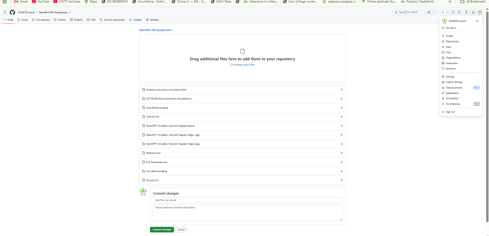

**Project Reflection -- Task Allocation and Contribution Table**

| **Student** | **Student ID** | **Actual Tasks Completed** | **GitHub Contribution** |
|---|---|---|---|
| **Pavan Reddy Chinthalapally** | `12327397` | OpenWrt VM configuration; network interface and connectivity testing; firewall configuration and testing; SSH hardening; password and key authentication; `tcpdump`/Wireshark traffic analysis; risk assessment support; report documentation. | Commits related to OpenWrt configuration, security testing, traffic analysis and documentation. |
| **Patel Ronak Ghanshyambhai** | `12328755` | Network planning and diagram development; website configuration/testing; firewall and connectivity support; risk assessment and security controls; report preparation; GitHub organisation and supporting documentation. | Commits related to network design, website, risk assessment, documentation and project organisation. |

I configured the OpenWrt virtual machine, tested network connectivity,
wrote firewall rules, system hardening, captured network traffic with
tcpdump and wireshark and assisted in the risk assessment. My teammate
was responsible for other work configuration, work documentation,
testing and work on GitHub. Our individual effort was demonstrated in
our commits to the Git database; however, we did not always have the top
number of commits for the highest effort since some were done in larger,
more fundamental commits and others in smaller, more granular ones.
Things were done during the project weeks and we committed. The group
was very good on communication and in sharing the testing, some delays
were depends on configuration errors. For future projects, the use of
regular task allocation, progress meetings, and more explicit
communication in the Git commit messages needs to be used to enhance
coordination and accountability.

**References**

Gentile, A.F., Macrì, D., Greco, E. and Fazio, P., 2024. IoT IP overlay
network security performance analysis with open source infrastructure
deployment. Journal of Cybersecurity and Privacy, 4(3), pp.629-649.

Kuruppathukattil, V., 2025, August. Optimized WiFi Network Deployment
with OpenWRT and FreeRadius for Secure and Scalable Connectivity. In
2025 IEEE 2nd International Conference on Information Technology,
Electronics and Intelligent Communication Systems (ICITEICS) (pp. 1-6).
IEEE.

Makris, N., 2024. Cyber range development: Configuration of the cyber
range environment network and monitoring tools (Master's thesis,
Πανεπιστήμιο Πειραιώς).
